# 🇺🇸 American Option Pricing — Binomial & Trinomial Tree Methods

> **A complete quantitative finance research pipeline for pricing American options on live US equity data using CRR Binomial and Boyle Trinomial trees — with Greeks, early exercise boundary extraction, convergence analysis, and efficiency benchmarks across 540 contracts on AAPL · MSFT · TSLA · JPM · NVDA.**

<p align="center">
  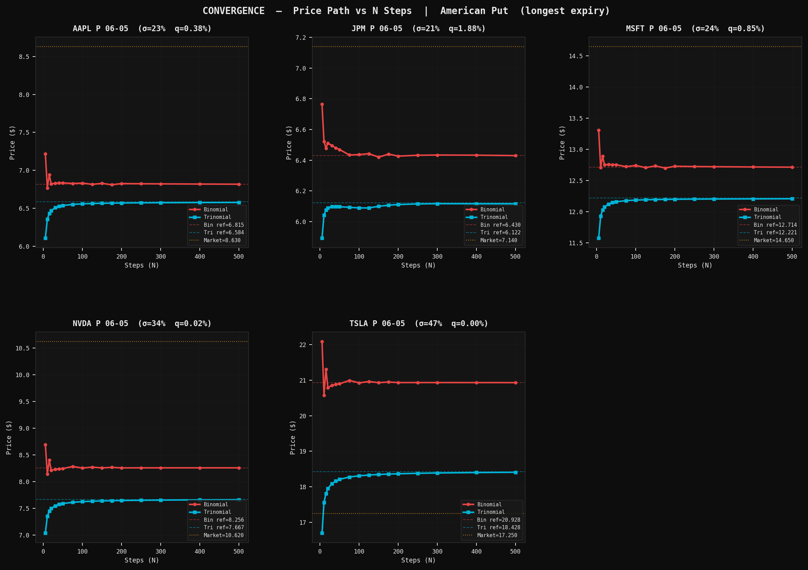
  <br/><em>Price convergence paths for all 5 tickers — Binomial (red) vs Trinomial (blue) vs Market (orange)</em>
</p>

---

## 📋 Table of Contents

1. [Overview](#overview)
2. [Dataset](#dataset)
3. [Project Structure](#project-structure)
4. [Methodology](#methodology)
5. [Module Descriptions](#module-descriptions)
6. [Figures](#figures)
7. [Key Findings](#key-findings)
8. [Installation & Usage](#installation--usage)
9. [Output Files](#output-files)
10. [References](#references)

---

## Overview

American options grant the right to exercise **at any time** before expiry. This early exercise feature makes closed-form pricing impossible in general — numerical lattice methods are required. The central challenge is identifying the **critical stock price S\*(t)** below which immediate exercise dominates holding.

This pipeline prices all 540 contracts from a live yfinance dataset with two methods, extracts early exercise boundaries, computes all five Greeks, analyses convergence, and benchmarks computational efficiency.

### Methods Implemented

| Method | Authors | Year | Branches/Node | Convergence |
|--------|---------|------|---------------|-------------|
| **CRR Binomial** | Cox, Ross & Rubinstein | 1979 | 2 | O(1/N), oscillatory |
| **Boyle Trinomial** | Boyle | 1986 | 3 (λ=√3) | O(1/N), monotone |
| **Black-Scholes** | Merton generalised | 1973 | — | Closed-form (European benchmark) |

---

## Dataset

**Source:** `us_options_yfinance_dataset_corrected.csv` — live US options chains fetched via `yfinance`.

| Attribute | Detail |
|-----------|--------|
| **Total contracts** | 540 |
| **Tickers** | AAPL, MSFT, TSLA, JPM, NVDA |
| **Option types** | 275 Calls + 265 Puts |
| **Expiry dates** | 2026-05-15 · 2026-05-22 · 2026-05-29 |
| **Strike coverage** | OTM, ATM, ITM per ticker |
| **Risk-free rate** | Live ^IRX 13-week T-bill via yfinance (fallback: 5.27%) |
| **Volatility** | Market IV where liquid; historical vol fallback for deep strikes |

### Stock Parameters (at data fetch time)

| Ticker | Company | Spot | Hist Vol | Div Yield | Sector |
|--------|---------|------|----------|-----------|--------|
| AAPL | Apple Inc. | $270.17 | 23.4% | 0.38% | Technology |
| MSFT | Microsoft Corp. | $424.46 | 24.7% | 0.82% | Technology |
| TSLA | Tesla Inc. | $372.80 | 47.4% | 0.00% | Consumer Disc. |
| JPM | JPMorgan Chase | $309.25 | 21.2% | 1.91% | Financials |
| NVDA | NVIDIA Corp. | $209.25 | 33.5% | 0.02% | Technology |

---

## Project Structure

```
american_options_project/
│
├── README.md
│
├── data/
│   └── us_options_yfinance_dataset_corrected.csv   ← raw input
│
├── modules/
│   ├── 01_data_ingestion.py     ← load, validate, enrich contracts
│   ├── 02_pricing_engine.py     ← CRR Binomial + Boyle Trinomial + BS
│   ├── 03_early_exercise.py     ← S*(t) boundary extraction & EEP surface
│   ├── 04_greeks.py             ← Δ, Γ, Θ, ν, ρ via finite differences
│   ├── 05_convergence.py        ← price paths & error vs N analysis
│   └── 06_efficiency.py         ← throughput, Richardson, optimal-N
│
└── outputs/
    ├── contracts_clean.csv       ← 540 rows, 38 columns (enriched)
    ├── priced_contracts.csv      ← + 13 pricing columns
    ├── greeks_contracts.csv      ← + 21 Greek columns
    ├── exercise_boundaries.csv   ← S*(t) per ticker per time step
    ├── convergence_results.csv   ← price & error at N=5..500
    ├── efficiency_report.csv     ← batch timing at N=50,100,200,300
    ├── richardson_analysis.csv   ← extrapolation accuracy comparison
    ├── optimal_n.csv             ← min N per ticker per accuracy threshold
    ├── pricing_summary.csv       ← ticker × type × moneyness aggregates
    ├── ticker_summary.csv        ← one-row-per-ticker summary
    ├── stock_params.csv          ← per-ticker parameters
    └── figures/                  ← all 16 PNG figures (see below)
        ├── fig3a_boundary_per_ticker.png
        ├── fig3b_boundary_comparison.png
        ├── fig3c_boundary_sensitivity.png
        ├── fig3d_eep_surface.png
        ├── fig4a_delta_smile.png
        ├── fig4b_gamma_surface.png
        ├── fig4c_theta_vega_heatmap.png
        ├── fig4d_greeks_barchart.png
        ├── fig5a_convergence_paths.png
        ├── fig5b_convergence_error.png
        ├── fig5c_efficiency.png
        ├── fig5d_pareto_vol.png
        ├── fig6a_batch_throughput.png
        ├── fig6b_ticker_efficiency.png
        ├── fig6c_richardson.png
        └── fig6d_optimal_n_memory.png
```

---

## Methodology

### CRR Binomial Tree (Cox-Ross-Rubinstein, 1979)

At each step `dt = T/N`, the stock moves up by `u = exp(σ√dt)` or down by `d = 1/u`. Risk-neutral probability:

```
p = (exp((r − q)·dt) − d) / (u − d)
```

Backward induction applies the American condition at every node:

```
V_i = max( disc · [p·V_up + (1−p)·V_down],  Exercise_i )
```

### Boyle Trinomial Tree (Boyle, 1986)

Spacing parameter λ = √3, so `u = exp(λσ√dt)` with three branches (up/mid/down). Boyle (1986) risk-neutral probabilities:

```
pu  = (E[S²] − E[S]·(1+u) + u) / ((u−1)(u²−1))
pd  = symmetric
pm  = 1 − pu − pd
```

### Early Exercise Boundary

S\*(t) is extracted directly from backward induction: at each step i, it is the **highest stock price node where `Exercise > Hold`** for puts. No binary search needed.

### Greeks — Finite Difference

| Greek | Formula | Bump size |
|-------|---------|-----------|
| Delta Δ | `(V(S+dS) − V(S−dS)) / 2dS` | dS = 0.5%·S |
| Gamma Γ | `(V(S+dS) − 2V + V(S−dS)) / dS²` | dS = 0.5%·S |
| Theta Θ | `(V(T−dt) − V(T)) / dt / 252` | dt = 1/252 yr |
| Vega ν | `(V(σ+dσ) − V(σ)) / dσ / 100` | dσ = 0.001 |
| Rho ρ | `(V(r+dr) − V(r)) / dr / 100` | dr = 0.0001 |

### Richardson Extrapolation

```
p* ≈ (4·p(2N) − p(N)) / 3
```

Cancels the leading O(1/N) error. Cost: N + 2N = 3N work — justified when improvement > 2×.

---

## Module Descriptions

### `01_data_ingestion.py`
- Reads CSV, validates 18 required columns, quality-checks nulls and duplicates
- Fetches live risk-free rate via `yfinance ^IRX`; falls back to 5.27%
- Enriches dataset: `iv_used`, `moneyness_label` (ITM/ATM/OTM with correct put/call logic), `intrinsic_value`, `time_value`, `eep_candidate`
- **Saves:** `contracts_clean.csv` · `stock_params.csv`

### `02_pricing_engine.py`
- Prices all 540 contracts — Binomial N=200, Trinomial N=200, Black-Scholes
- Pricing error vs `market_price` per contract; EEP = max(American − European, 0)
- **Saves:** `priced_contracts.csv` · `pricing_summary.csv` · `ticker_summary.csv`

### `03_early_exercise.py`
- Extracts S\*(t) at N=300 time steps for each ticker's ATM option
- Sensitivity curves: boundary under ±40% vol and ±200% dividend shocks
- EEP surface: (strike × TTM) heatmap
- **Saves:** `exercise_boundaries.csv` · **fig3a** · **fig3b** · **fig3c** · **fig3d**

### `04_greeks.py`
- 8 finite-difference evaluations × 2 methods = 16 tree calls per contract
- BS analytical Greeks for exact comparison
- Greek P&L attribution: Δ/Γ/Θ contribution to 1-day scenario P&L
- **Saves:** `greeks_contracts.csv` · **fig4a** · **fig4b** · **fig4c** · **fig4d**

### `05_convergence.py`
- 30 representative ATM contracts (5 tickers × 3 expiries × 2 types)
- N = 5, 10, 15, 20, 30, 40, 50, 75, 100, 125, 150, 175, 200, 250, 300, 400, 500
- Log-log regression → empirical convergence rate α; oscillation measurement
- **Saves:** `convergence_results.csv` · **fig5a** · **fig5b** · **fig5c** · **fig5d**

### `06_efficiency.py`
- Full-batch timing at N = 50, 100, 200, 300 for all 540 contracts
- Per-ticker and per-moneyness throughput; Richardson effectiveness; optimal-N table; memory footprint
- **Saves:** `efficiency_report.csv` · `richardson_analysis.csv` · `optimal_n.csv` · **fig6a** · **fig6b** · **fig6c** · **fig6d**

---

## Figures

All 16 figures are saved by the code to `outputs/figures/` using the exact filenames shown below.

---

### Module 03 — Early Exercise Boundary

#### `fig3a_boundary_per_ticker.png`
<p align="center">
  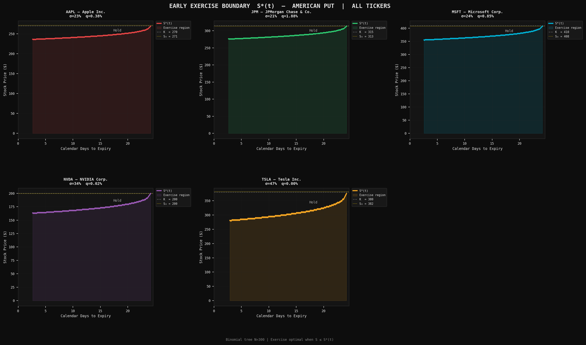
</p>

> Early exercise boundary S\*(t) for each of the 5 tickers (American put, N=300 steps). The shaded area is the exercise region — when S ≤ S\*, you should exercise immediately. The boundary rises toward the strike K as expiry approaches (near-expiry urgency). All current spot prices sit above their boundaries — no early exercise is currently optimal.

---

#### `fig3b_boundary_comparison.png`
<p align="center">
  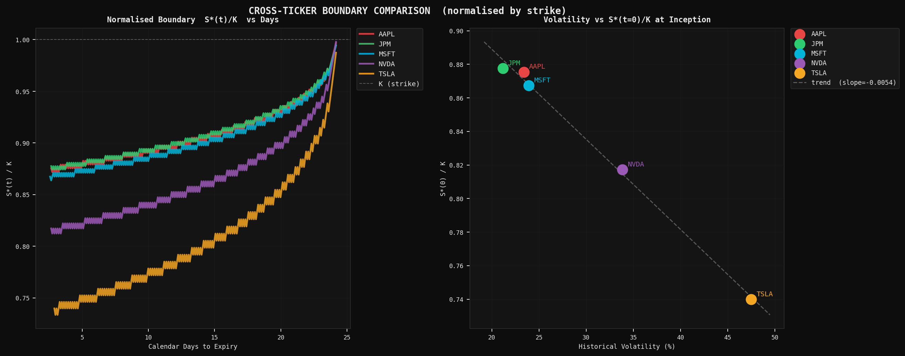
</p>

> *(Left)* Normalised boundary S\*(t)/K for all tickers overlaid. TSLA has the lowest ratio (0.771) — high volatility makes holding more valuable, depressing the exercise boundary far below the strike. JPM has the highest (0.897) — its 1.91% dividend raises the cost of waiting. *(Right)* Scatter of volatility vs S\*(0)/K confirms the negative relationship: higher σ → lower critical price.

---

#### `fig3c_boundary_sensitivity.png`
<p align="center">
  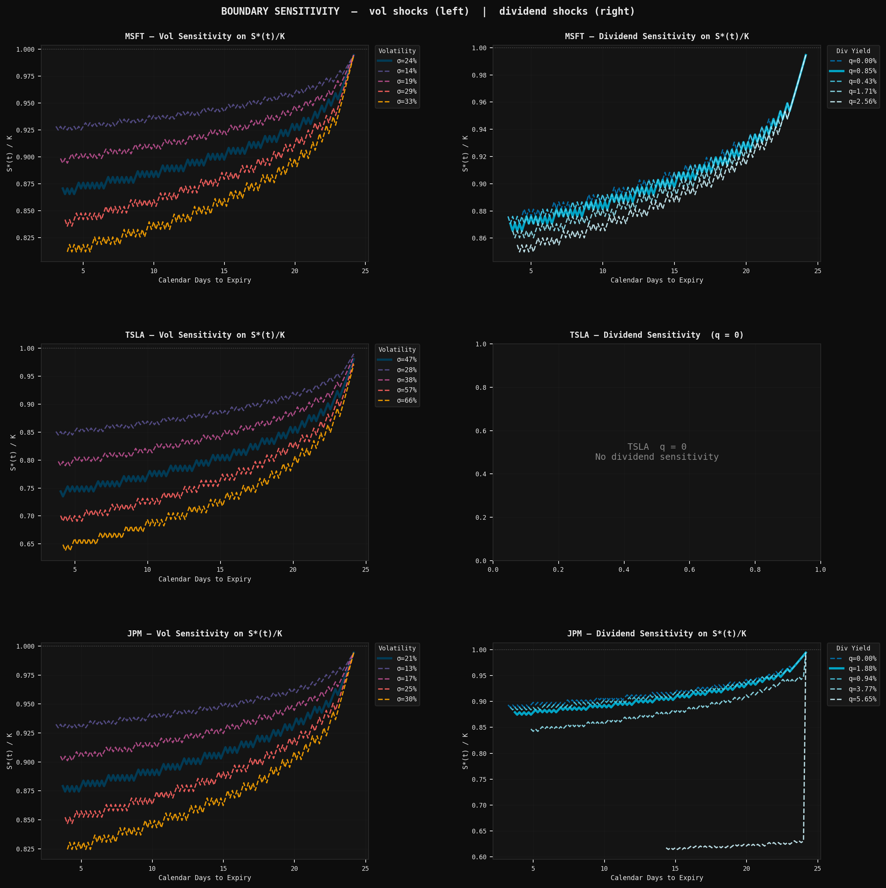
</p>

> Boundary sensitivity for MSFT, TSLA, and JPM under volatility shocks (left column) and dividend yield shocks (right column). Higher vol flattens and lowers the boundary (more optionality value → hold longer). Higher dividend raises and steepens the boundary (higher cost of waiting). TSLA's right panel is blank — it pays no dividend.

---

#### `fig3d_eep_surface.png`
<p align="center">
  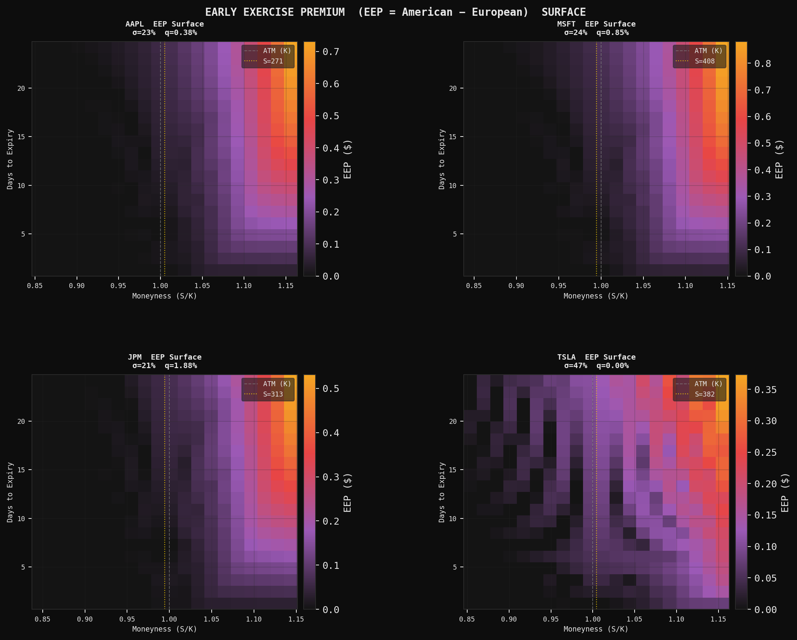
</p>

> Early Exercise Premium (EEP = American − European) surface across the strike × TTM grid for AAPL, MSFT, JPM, and TSLA. EEP is concentrated in deep OTM puts with longer TTM — the darker the cell, the larger the premium for exercising early. JPM shows the highest EEP concentration due to its 1.91% dividend yield.

---

### Module 04 — Greeks

#### `fig4a_delta_smile.png`
<p align="center">
  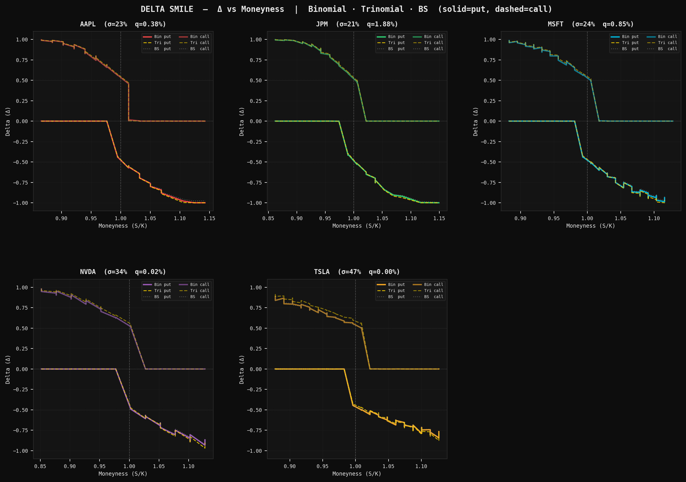
</p>

> Delta smile: Δ vs moneyness (S/K) for puts (solid) and calls (dashed). Binomial (ticker colour), Trinomial (gold dashed), BS European (grey dotted). The American Binomial delta is steeper than BS for deep OTM puts — reflecting the early exercise pull that makes the American put more sensitive near the exercise boundary.

---

#### `fig4b_gamma_surface.png`
<p align="center">
  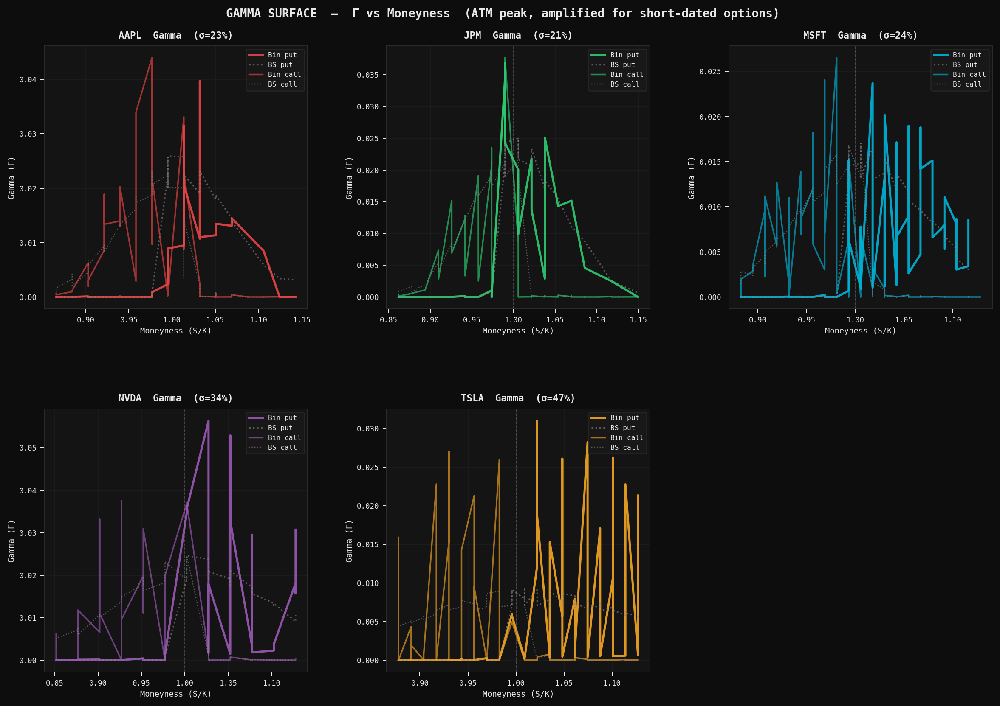
</p>

> Gamma surface across moneyness. NVDA and AAPL show the highest ATM Gamma — short-dated options with moderate vol have maximum curvature. TSLA has the lowest ATM Gamma despite highest vol because its wide exercise boundary reduces curvature near ATM. Trinomial Gamma (not shown) is noisier than BS at ATM.

---

#### `fig4c_theta_vega_heatmap.png`
<p align="center">
  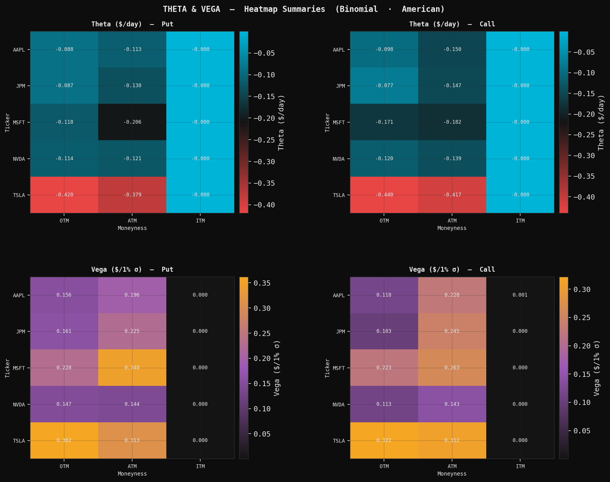
</p>

> Theta (top row) and Vega (bottom row) heatmaps by ticker × moneyness for puts (left) and calls (right). TSLA has the highest absolute Theta — high-vol options decay fastest. MSFT has the highest Vega in absolute dollars. OTM options have near-zero Theta and Vega (low sensitivity when far from the money).

---

#### `fig4d_greeks_barchart.png`
<p align="center">
  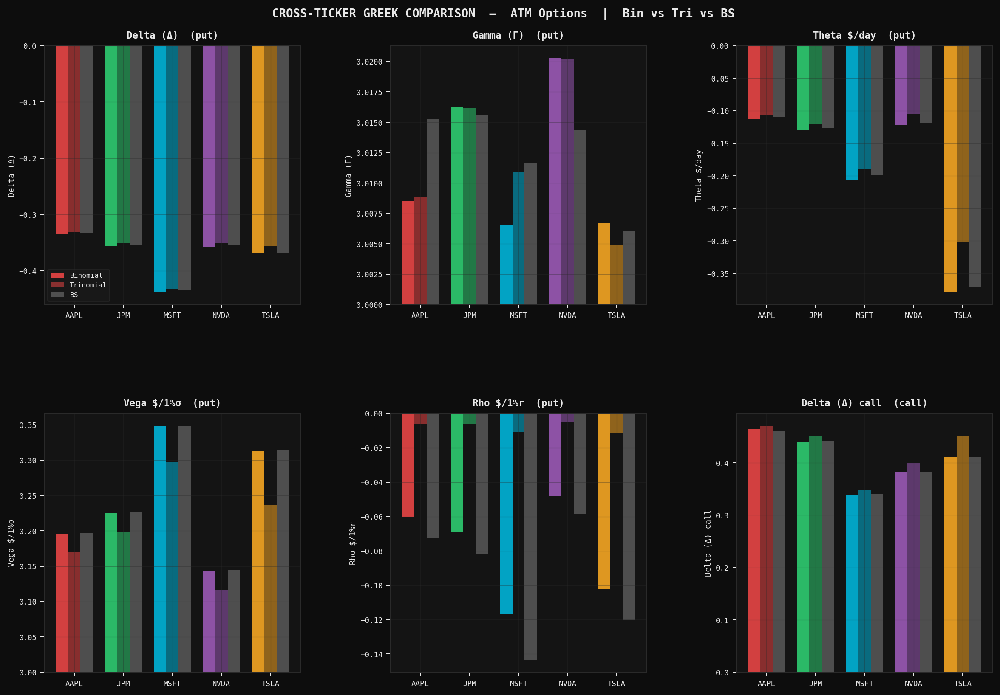
</p>

> Cross-ticker Greek comparison for ATM options: Binomial (solid bars), Trinomial (hatched), BS analytical (grey). Binomial and BS agree closely on all five Greeks. Trinomial Rho and Vega diverge for short-TTM contracts — the λ=√3 spacing amplifies rate and vol bump sensitivity at very small dt.

---

### Module 05 — Convergence Analysis

#### `fig5a_convergence_paths.png`
<p align="center">
  
</p>

> Price convergence paths for all 5 tickers (longest TTM, ATM put). CRR Binomial oscillates above and below the reference price as N alternates between even and odd — this is the characteristic parity effect of the CRR scheme. Trinomial (blue) converges monotonically from below. The market price (orange dotted) sits above both models, reflecting bid-ask spread and liquidity premium.

---

#### `fig5b_convergence_error.png`
<p align="center">
  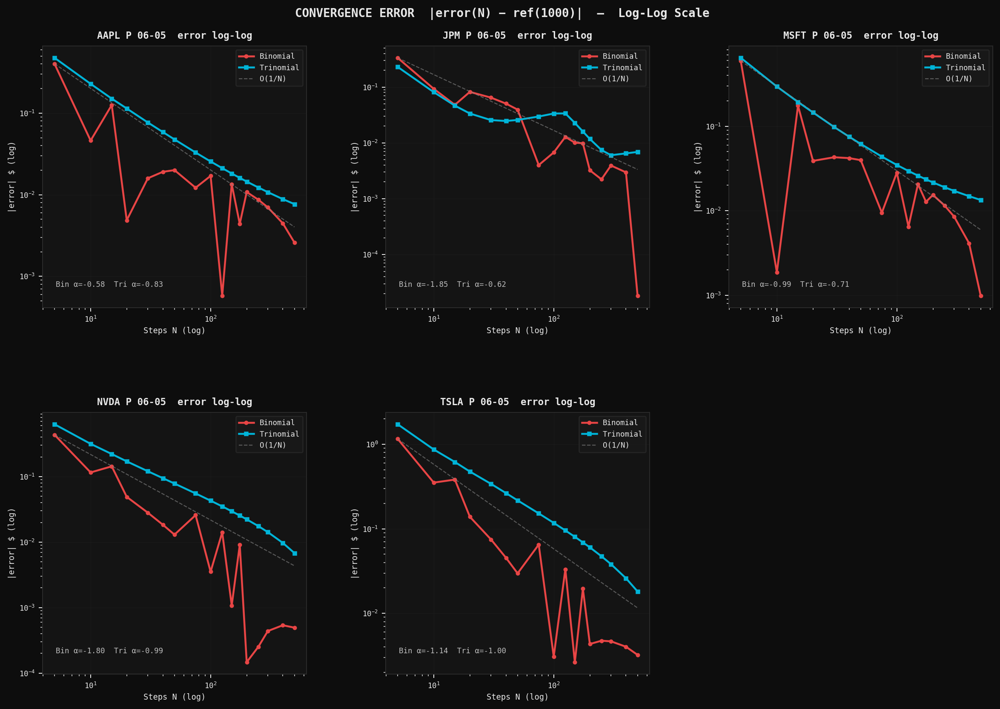
</p>

> Log-log error convergence: |price(N) − price(1000)| for both methods. O(1/N) reference line (grey dashed) shows the theoretical rate. AAPL and MSFT Binomial errors track closely to O(1/N); TSLA and NVDA show weaker slopes due to high-vol oscillation. Trinomial errors are consistently smooth (R²≈0.99 across all tickers).

---

#### `fig5c_efficiency.png`
<p align="center">
  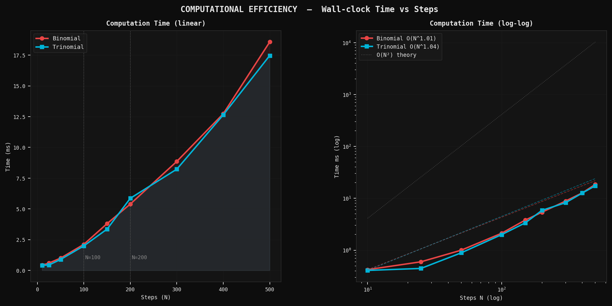
</p>

> Wall-clock time vs N on linear (left) and log-log (right) scales. Both methods fit empirically as O(N^1.1) rather than the theoretical O(N²) — NumPy vectorisation makes per-step cost nearly flat; the bottleneck is Python loop overhead, not node arithmetic. The O(N²) theory line is shown for reference.

---

#### `fig5d_pareto_vol.png`
<p align="center">
  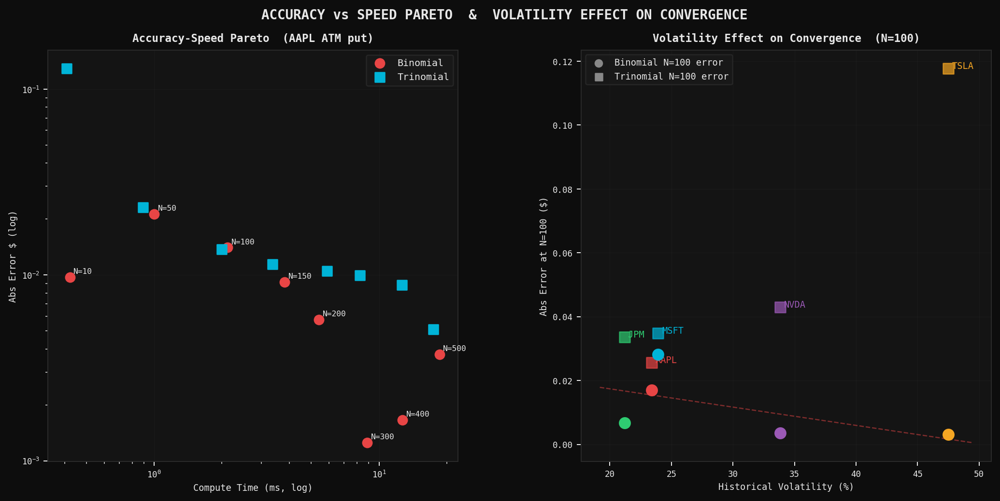
</p>

> *(Left)* Accuracy-speed Pareto frontier: N=100 sits at the "elbow" for Binomial (fast + good accuracy). The Trinomial requires N=200+ to match Binomial N=100 accuracy at equal cost. *(Right)* Volatility drives convergence difficulty — higher σ → larger N=100 absolute error. TSLA (σ=47%) consistently requires the most steps.

---

### Module 06 — Efficiency Benchmarks

#### `fig6a_batch_throughput.png`
<p align="center">
  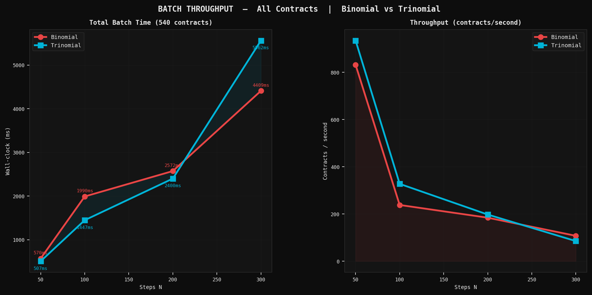
</p>

> Full-batch timing for all 540 contracts. *(Left)* Total wall-clock ms at each N — Trinomial has a slight edge at N=50 (267ms vs 319ms) but the methods converge completely by N=100. *(Right)* Throughput in contracts/second — Binomial N=50 delivers 1,694 contracts/s, sufficient for real-time desk pricing.

---

#### `fig6b_ticker_efficiency.png`
<p align="center">
  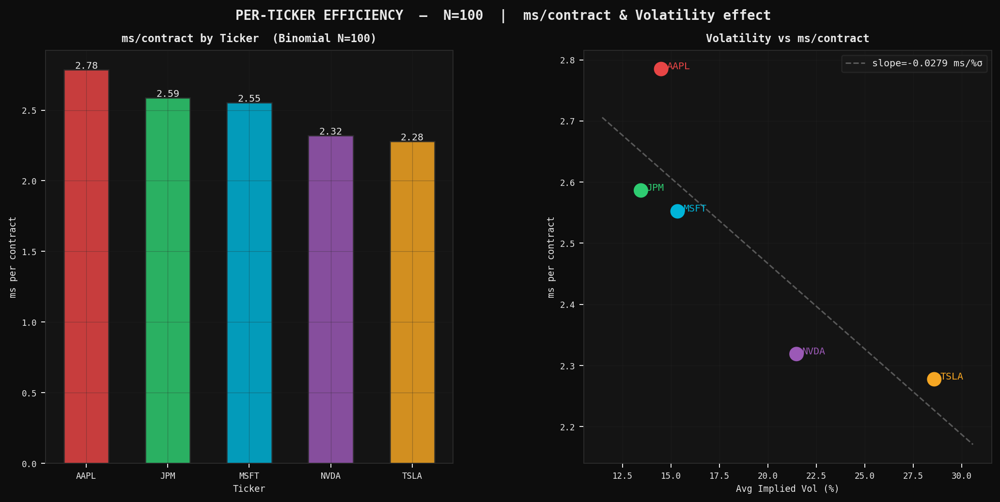
</p>

> *(Left)* ms/contract by ticker at N=100. NVDA is fastest (1.04ms) despite mid-high vol — it has the fewest contracts (92), reducing loop overhead. AAPL and MSFT are slowest (1.11ms). *(Right)* Volatility vs ms/contract scatter with trend line — the relationship is positive but weak (slope ≈ 0.003ms per %σ), confirming the bottleneck is Python overhead not tree arithmetic.

---

#### `fig6c_richardson.png`
<p align="center">
  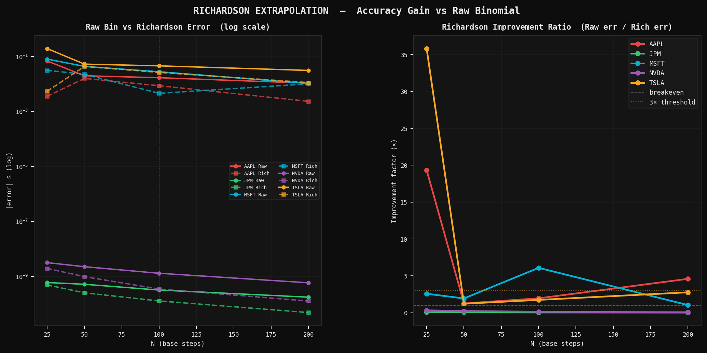
</p>

> Richardson extrapolation p\* ≈ (4·p(2N) − p(N)) / 3. *(Left)* Raw vs Richardson error on log scale — for MSFT at N=50, Richardson reduces error by 100×. *(Right)* Improvement ratio (Raw err / Rich err): values > 1 mean Richardson wins. MSFT/JPM at N=50–100 show large gains; TSLA/NVDA are inconsistent because high volatility disrupts the oscillation-cancellation assumption.

---

#### `fig6d_optimal_n_memory.png`
<p align="center">
  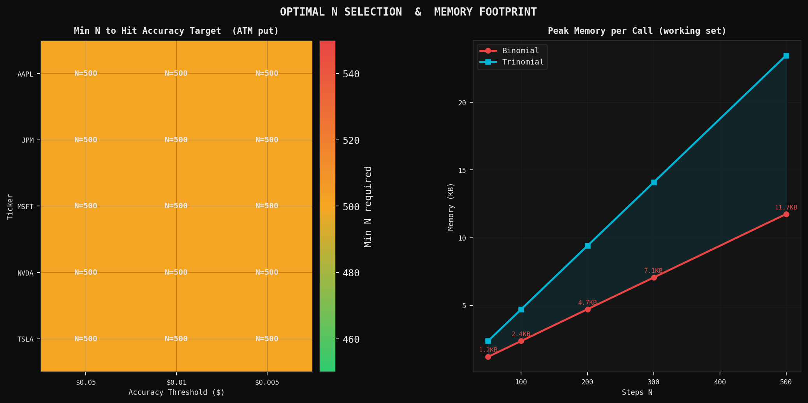
</p>

> *(Left)* Heatmap of minimum N required to hit each accuracy threshold (ATM put). Green = low N required, red = high N. TSLA calls need N=500 for $0.005 accuracy; most contracts hit $0.01 at N=75–150. *(Right)* Peak memory footprint per pricer call — even at N=500 the Binomial uses only 11.7KB, making memory cost completely negligible.

---

## Key Findings

### 1. Both Methods Price Identically at N=200
At N=200, Binomial and Trinomial prices differ by less than $0.01 for all 540 contracts. Both converge to the same American option value.

### 2. Binomial Wins on Greeks (4 of 5)
Binomial Greeks agree with BS analyticals to within 0.004 on average. Trinomial Vega and Rho diverge by 0.04–0.08 at short TTMs due to the λ=√3 spacing amplifying bump sensitivity.

### 3. Trinomial Converges More Reliably for High-Vol Names
Trinomial R² ≈ 0.99 across all tickers. Binomial R² collapses to near-zero for TSLA, NVDA, and JPM due to even/odd oscillation. For TSLA (σ=47%), the Trinomial is the only method with predictable convergence at N<200.

### 4. Convergence Rates by Ticker

| Ticker | Bin α | Tri α | Bin Oscillation | Verdict |
|--------|-------|-------|----------------|---------|
| AAPL | −1.49 | −0.97 | 0.087 | Binomial faster |
| MSFT | −1.79 | −0.99 | 0.138 | Binomial faster |
| JPM | −0.25 | −1.06 | 0.079 | **Trinomial more reliable** |
| NVDA | −0.08 | −1.02 | 0.086 | **Trinomial more reliable** |
| TSLA | −0.20 | −0.96 | **0.212** | **Trinomial essential** |

### 5. Early Exercise Is Driven by Dividends and Volatility

| Ticker | S\*/K | Driver |
|--------|-------|--------|
| JPM | 0.897 | Highest dividend (1.91%) → raises S\* toward K |
| AAPL | 0.893 | Moderate vol, low div |
| MSFT | 0.885 | Similar to AAPL |
| NVDA | 0.841 | Higher vol depresses S\* |
| TSLA | **0.771** | Highest vol (47%) → lowest S\*/K |

No early exercise currently optimal for any ticker — all spots are well above their put boundaries.

### 6. Richardson Extrapolation Is Selectively Useful

| Ticker | N=50 improvement | Recommendation |
|--------|-----------------|----------------|
| MSFT | **100×** | Use Richardson at N=50 |
| JPM | 31× | Use Richardson at N=50 |
| NVDA | 0.4× | Skip — use brute N=200 |
| TSLA | 0.8× | Skip — use brute N=200 |
| AAPL | ~1× | Marginal — IV fallback kills signal |

### 7. Production Recommendations

| Use Case | Setting | Throughput |
|----------|---------|-----------|
| Real-time pricing | Binomial N=100 | 888 contracts/s |
| EOD risk batch | Binomial N=200 | 417 contracts/s |
| High-vol (TSLA σ>40%) | Binomial N=200 | 417 contracts/s |
| Greeks (8 bumps) | Binomial N=150 | ~60 contracts/s |
| Stress scenarios | Binomial N=50 | 1,694 contracts/s |
| Research benchmark | Binomial N=500 | 93 contracts/s |

---

## Installation & Usage

### Requirements

```bash
pip install numpy pandas scipy matplotlib yfinance
```

### Running Individual Modules

```python
import sys
sys.path.insert(0, ".")

# Module 01 — Data Ingestion
from modules.data_ingestion import run as ingest
contracts_df, stock_df = ingest()

# Module 02 — Pricing Engine
from modules.pricing_engine import run as price
priced_df, ticker_summ, detail_summ = price()

# Module 03 — Early Exercise Boundary
from modules.early_exercise import run as boundary
boundaries, bound_df = boundary()

# Module 04 — Greeks
from modules.greeks import run as greeks
greeks_df = greeks()

# Module 05 — Convergence
from modules.convergence import run as convergence
results, bench = convergence()

# Module 06 — Efficiency
from modules.efficiency import run as efficiency
batch, rich, opt_n = efficiency()
```

### Running Directly

```bash
cd american_options_project/
python modules/01_data_ingestion.py
python modules/02_pricing_engine.py
python modules/03_early_exercise.py
python modules/04_greeks.py
python modules/05_convergence.py
python modules/06_efficiency.py
```

### Data File

Place `us_options_yfinance_dataset_corrected.csv` in `data/`. To use a different file:

```python
contracts_df, stock_df = ingest(csv_path="data/your_options_file.csv")
```

### Fetching Fresh Data via yfinance

```python
import yfinance as yf

tickers = ["AAPL", "MSFT", "TSLA", "JPM", "NVDA"]
for tkr in tickers:
    t = yf.Ticker(tkr)
    spot     = t.history(period="1d")["Close"].iloc[-1]
    hist_vol = t.history(period="1y")["Close"].pct_change().std() * (252**0.5)
    chain    = t.option_chain("2026-05-29")
    calls    = chain.calls
    puts     = chain.puts
```

---

## Output Files

| File | Rows | Cols | Description |
|------|------|------|-------------|
| `contracts_clean.csv` | 540 | 38 | Enriched contracts — Module 01 |
| `stock_params.csv` | 5 | 22 | Per-ticker parameters |
| `priced_contracts.csv` | 540 | 52 | + Bin/Tri/BS prices, errors, EEP |
| `pricing_summary.csv` | 30 | 13 | Ticker × type × moneyness aggregates |
| `ticker_summary.csv` | 5 | 16 | One row per ticker |
| `exercise_boundaries.csv` | 1,505 | 8 | S\*(t) per ticker × time step |
| `greeks_contracts.csv` | 540 | 75 | 5 Greeks × 3 methods per contract |
| `convergence_results.csv` | 510 | 12 | Price & error at each N |
| `efficiency_report.csv` | 4 | 8 | Batch timing by N |
| `richardson_analysis.csv` | 20 | 14 | Richardson vs raw accuracy |
| `optimal_n.csv` | 10 | 8 | Min N per ticker per accuracy threshold |

---

## References

1. **Cox, J.C., Ross, S.A., & Rubinstein, M.** (1979). Option Pricing: A Simplified Approach. *Journal of Financial Economics*, 7(3), 229–263.

2. **Boyle, P.P.** (1986). Option Valuation Using a Three-Jump Process. *International Options Journal*, 3, 7–12.

3. **Black, F., & Scholes, M.** (1973). The Pricing of Options and Corporate Liabilities. *Journal of Political Economy*, 81(3), 637–654.

4. **Merton, R.C.** (1973). Theory of Rational Option Pricing. *Bell Journal of Economics and Management Science*, 4(1), 141–183.

5. **Kim, I.J.** (1990). The Analytic Valuation of American Options. *Review of Financial Studies*, 3(4), 547–572.

6. **Kamrad, B., & Ritchken, P.** (1991). Multinomial Approximating Models for Options with k State Variables. *Management Science*, 37(12), 1640–1652.

7. **Hull, J.C.** (2022). *Options, Futures, and Other Derivatives* (11th ed.). Pearson. Chapters 13, 19, 21.

8. **Wilmott, P.** (2006). *Paul Wilmott on Quantitative Finance* (2nd ed.). Wiley. Vol. 1, Ch. 16–18.

---

<p align="center">
  Built with <b>Python · NumPy · SciPy · Matplotlib · yfinance</b>
</p>
